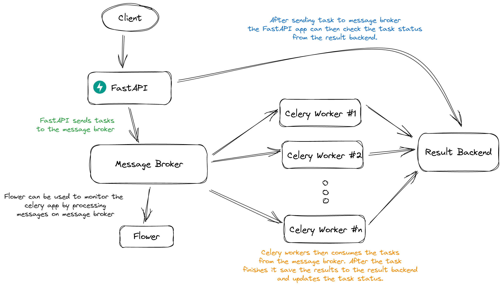

<center>

# Python FastAPI Webhook listener

_An exmaple webhook listener with task queueing architecture_

 

   

</center>



## Getting started on development

This project is written using Docker compose. So running the project simply takes 0 effort. Simply do

```bash
docker-compose up --build
```

## Setting up authentication for Flower

To add basic authentication, first create a _htpasswd_ file.

```bash
htpasswd -c htpasswd username
```

Next, add another volume to the `nginx` service to mount the _htpasswd_ from the host to _/etc/nginx/.htpasswd_ in the container:

```yml
ngxinx:
  image: nginx:latest
  volumes:
    - ./nginx.conf:/etc/nginx/nginx.conf
    - ./htpasswd:/etc/nginx/.htpasswd
  ports:
    - 80:80
  depends_on:
    - flower
```

Finally, to protect the "/" route, add auth_basic and auth_basic_user_file directives to the location block:

```nginx
events {}

http {
  server {
    listen 80;
    # server_name your.server.url;

    location / {
        proxy_pass http://flower:5555;
        proxy_set_header Host $host;
        proxy_redirect off;
        proxy_http_version 1.1;
        proxy_set_header Upgrade $http_upgrade;
        proxy_set_header Connection "upgrade";

        auth_basic  "Restricted";
        auth_basic_user_file  /etc/nginx/.htpasswd;
    }
  }
}
```

Flower auth credentials

```
Username: username
password: password
```
