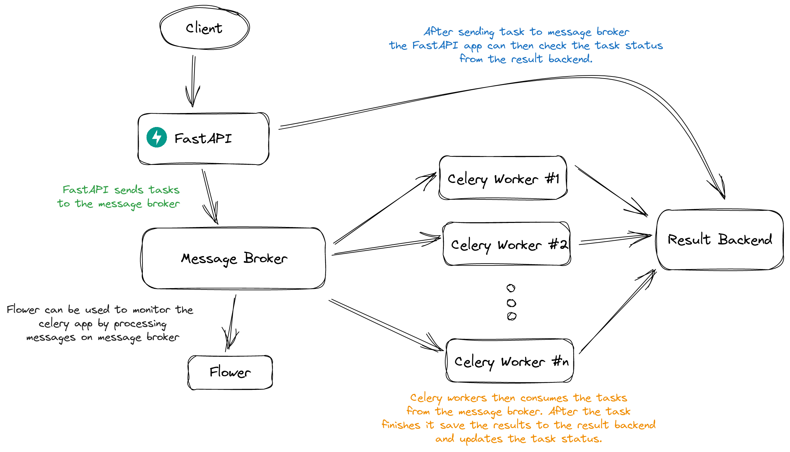

<center>
# Webhook listener - FastAPI | Celery | Redis

_An exmaple webhook listener with task queueing architecture_

 

  

</center>



## Getting Started

**1. Clone the repository locally**

```bash
git clone git@github.com:Mukhopadhyay/Webhook-listener.git && cd Webhook-listener
```

**2. Creating an `.env` file**

**3. Building the project locally**

```bash
docker-compose up --build
```
